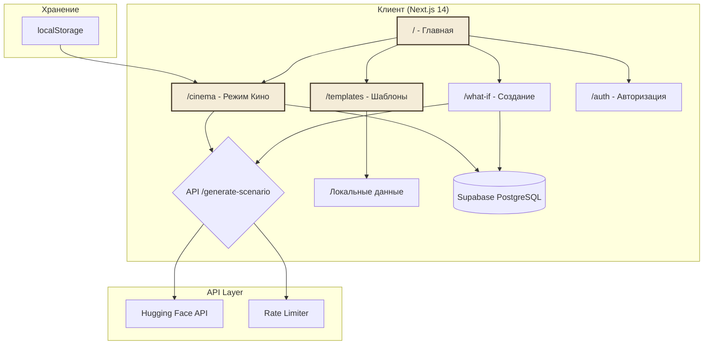

# План разработки "What If Device"

Этот документ описывает детальный план разработки и текущий статус веб-приложения "What If Device".

## Текущий статус: ✅ v1.0.0 РЕЛИЗ

**Дата релиза:** Февраль 2025

## Архитектура системы



## Реализованные функции ✅

### Этап 1: Базовая инфраструктура ✅
- [x] Настройка Next.js 14 с App Router
- [x] Интеграция Tailwind CSS и shadcn/ui
- [x] Настройка TypeScript
- [x] Конфигурация окружения (.env.local)

### Этап 2: AI Интеграция ✅
- [x] Интеграция с Hugging Face API
- [x] Реализация Qwen/Qwen2.5-72B-Instruct
- [x] API маршрут /api/generate-scenario
- [x] Обработка ошибок и таймаутов
- [x] Rate limiting (10/50 запросов в час)

### Этап 3: База данных и аутентификация ✅
- [x] Интеграция Supabase
- [x] Таблицы: stories, scenarios
- [x] RLS политики безопасности
- [x] Email/Password авторизация
- [x] Google OAuth
- [x] Гостевой режим без регистрации

### Этап 4: Основной функционал ✅
- [x] Страница создания сценария (/what-if)
- [x] Интерактивный чат (/chat/[id])
- [x] История сценариев (/history)
- [x] Система шаблонов (/templates)
  - [x] 64 шаблона историй
  - [x] Фильтрация по категориям
  - [x] Сортировка
  - [x] Копирование текста

### Этап 5: Режим Кино ✅
- [x] Интерактивные истории с выбором
- [x] 6 жанров (киберпанк, фэнтези, нуар, хоррор, sci-fi, мистика)
- [x] Детерминированная генерация (seed-based)
- [x] 8 типов концовок
- [x] Собственные действия (пользовательский ввод)
- [x] Сохранение сессий в localStorage
- [x] Код сессии для обмена с друзьями

### Этап 6: UI/UX ✅
- [x] Книжная тема (винтаж/пергамент)
- [x] Цветовая схема: кремовый/коричневый
- [x] Типографика: EB Garamond + Inter
- [x] Анимации:
  - [x] Fade in/out
  - [x] Slide transitions
  - [x] Hover эффекты (lift, glow)
  - [x] Печатная машинка
  - [x] Float анимация
- [x] Адаптивный дизайн
- [x] Темная/светлая тема
- [x] Иконки сайта (SVG)

### Этап 7: Оптимизация и полировка ✅
- [x] Автозаполнение вопроса из подсказок
- [x] Компонент QuestionLoader
- [x] Suspense boundaries
- [x] Улучшенная обработка ошибок
- [x] Toast-уведомления
- [x] Skeleton loaders

## Технический стек

### Frontend
- **Framework:** Next.js 14.2.15
- **Language:** TypeScript 5.0
- **Styling:** Tailwind CSS 3.4
- **Components:** shadcn/ui
- **Fonts:** EB Garamond, Inter
- **Animation:** CSS + Framer Motion (опционально)

### Backend
- **API:** Next.js API Routes
- **AI:** Hugging Face Inference API
- **Rate Limiting:** In-memory + Vercel KV (опционально)

### Database & Auth
- **Provider:** Supabase
- **Database:** PostgreSQL
- **Auth:** Supabase Auth (Email + OAuth)
- **Storage:** localStorage (гостевой режим)

### Deployment
- **Platform:** Vercel
- **CI/CD:** GitHub Actions (опционально)

## API Endpoints

### POST /api/generate-scenario
Генерация сценария или сцены для режима Кино.

**Request:**
```json
{
  "mode": "cinema" | null,
  "story": "string",
  "question": "string",
  "genre": "string" (optional),
  "history": ["string"] (optional)
}
```

**Response:**
```json
{
  "scenario": "string",
  "choices": [{"id": "string", "text": "string"}],
  "isEnding": boolean,
  "endingTitle": "string",
  "endingCode": "string"
}
```

### POST /api/scenario
Сохранение сценария в базу данных.

**Request:**
```json
{
  "story_id": "uuid",
  "question": "string",
  "ai_response": "string"
}
```

## Структура базы данных

### Таблица: stories
```sql
id: uuid (PK)
user_id: uuid (FK -> auth.users)
title: text
content: text
created_at: timestamp
created_by: uuid
```

### Таблица: scenarios
```sql
id: uuid (PK)
story_id: uuid (FK -> stories)
user_id: uuid (FK -> auth.users)
question: text
ai_response: text
created_at: timestamp
```

## Переменные окружения

```env
# Обязательные
HF_TOKEN=your_hugging_face_token

# Опциональные (для сохранения)
NEXT_PUBLIC_SUPABASE_URL=your_supabase_url
NEXT_PUBLIC_SUPABASE_ANON_KEY=your_supabase_anon_key
SUPABASE_SERVICE_ROLE_KEY=your_service_role_key
```

## Ограничения системы

### AI Генерация
- Таймаут: 60 секунд
- Максимальный размер ответа: 1500 токенов
- Rate limit: 10/час (гость), 50/час (авторизованный)

### Хранение данных
- Гостевой режим: localStorage (~5MB)
- Авторизованный: Supabase (без ограничений)
- Сессии Кино: localStorage

### Валидация
- История: макс. 50,000 символов
- Вопрос: макс. 10,000 символов
- XSS защита: встроенная

## Производительность

### Метрики
- First Contentful Paint: < 1.5s
- Time to Interactive: < 3s
- API Response Time: < 30s (AI генерация)
- Lighthouse Score: > 80

### Оптимизации
- Статическая генерация страниц (SSG)
- Оптимизированные изображения (SVG иконки)
- Lazy loading для компонентов
- Кэширование API (5 минут)

## Безопасность

### Реализованные меры
- ✅ RLS (Row Level Security) для Supabase
- ✅ Rate limiting на API
- ✅ Input validation
- ✅ XSS protection
- ✅ CSRF protection (Next.js встроенный)
- ✅ CORS настроен

### Рекомендации
- Использовать HTTPS в продакшене
- Регулярно обновлять зависимости
- Мониторинг через Vercel Analytics

## Будущие улучшения 🚀

### Высокий приоритет
- [ ] Экспорт сценариев в PDF
- [ ] Поделиться сценарием (публичная ссылка)
- [ ] Многопользовательский режим (совместное создание)

### Средний приоритет
- [ ] Голосовой ввод (Web Speech API)
- [ ] Интеграция с другими AI моделями (GPT-4, Claude)
- [ ] Оффлайн режим (PWA)

### Низкий приоритет
- [ ] Мобильное приложение (React Native)
- [ ] Интеграция с соцсетями
- [ ] Платная подписка (больше лимитов)

## Полезные ссылки

- [PRD.md](./PRD.md) — Product Requirements Document
- [README.md](../README.md) — Основная документация
- [TROUBLESHOOTING.md](../TROUBLESHOOTING.md) — Решение проблем
- [DEPLOY_GUIDE.md](../DEPLOY_GUIDE.md) — Руководство по деплою

---

*Последнее обновление: Февраль 2025*
*Версия: 1.0.0*
